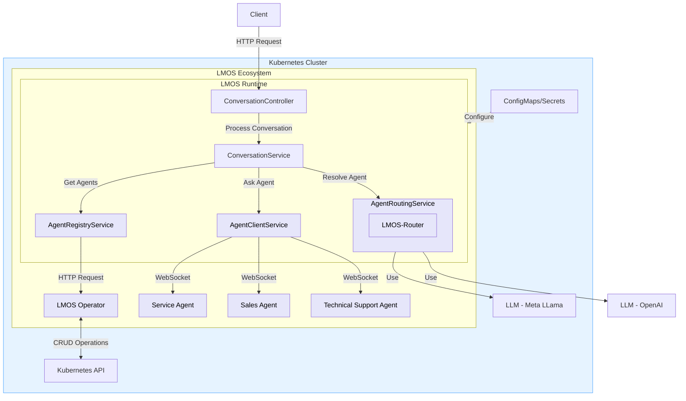

# lmos-runtime
[](https://www.apache.org/licenses/LICENSE-2.0)
[](CODE_OF_CONDUCT.md)

LMOS Runtime is a component of the LMOS (Language Model Operating System) ecosystem, designed to facilitate dynamic agent routing and conversation handling in a multi-tenant, multi-channel environment.

It is a comprehensive system designed to manage and route conversations to the most suitable agents based on their capabilities. 
It leverages the LMOS Operator and LMOS Router to dynamically resolve and route user queries to the appropriate agents.
This project extends the functionalities of the original [lmos-operator](https://github.com/lmos-ai/lmos-operator/)  and [lmos-router](https://github.com/lmos-ai/lmos-router) by integrating them into a cohesive runtime environment.

The LMOS Runtime directs user queries to an agent based on its capabilities. 
It fetches the list of all installed agents applicable to the tenant and channel from lmos-operator, and uses lmos-router to dynamically resolve the most appropriate agent for each query. 
The user queries are then forwarded to the selected agent, and the response is returned to the client.

## Features

- **Dynamic Agent Routing** : Routes user queries to the most appropriate agent dynamically.
- **Scalability**: Designed to handle **Multi-tenant** and **multi-channel** efficiently.
- **Extensible Architecture**: Easily extendable for adding more agents and routing logic.



## Configuration

LMOS Runtime can be configured using Kubernetes ConfigMaps and Secrets. 
To customize the settings, create a ConfigMap or Secret and mount it to the LMOS Runtime deployment.

You can adjust the following properties:

| Property                             | Kubernetes ConfigMaps/ Secrets     | Description                                               | Default                     |
|--------------------------------------|------------------------------------|-----------------------------------------------------------|-----------------------------|
| `lmos.runtime.agentRegistry.baseUrl` | LMOS_RUNTIME_AGENTREGISTRY_BASEURL | URL of the agent registry service                         | `http://lmos-operator:8080` |
| `lmos.runtime.openAI.url`            | LMOS_RUNTIME_OPENAI_URL            | OpenAI API URL                                            | `https://api.openai.com/v1` |
| `lmos.runtime.openAI.model`          | LMOS_RUNTIME_OPENAI_MODEL          | OpenAI model to use                                       | `GPT35T-1106`               |
| `lmos.runtime.openAI.maxTokens`      | LMOS_RUNTIME_OPENAI_MAX-TOKENS     | Maximum tokens for OpenAI requests                        | `10000`                     |
| `lmos.runtime.openAI.temperature`    | LMOS_RUNTIME_OPENAI_TEMPERATURE    | Temperature for OpenAI requests                           | `0.0`                       |
| `lmos.runtime.openAI.format`         | LMOS_RUNTIME_OPENAI_FORMAT         | Output format for OpenAI requests                         | `json_format`               |
| `lmos.runtime.openAI.key`            | LMOS_RUNTIME_OPENAI_KEY            | OpenAI API key (**should be set as a Kubernetes secret**) | `null`                      |

## Setup and Installation
### How to install on a Kubernetes cluster:

#### Follow steps to [install lmos-operator](https://github.com/lmos-ai/lmos-operator/blob/main/readme.md) on kubernetes cluster

Install lmos-runtime

```
helm install lmos-runtime oci://ghcr.io/lmos-ai/lmos-runtime-chart --version <current_version>
```

### How to test locally:

#### Follow steps to [install lmos-operator](https://github.com/lmos-ai/lmos-operator/blob/main/readme.md) on Minikube

Clone and start the lmos-runtime:

```
git clone https://github.com/lmos-ai/lmos-runtime
```
update the endpoint of lmos-operator, endpoint and key of openai in [application.yml](src/main/resources/application.yaml)

```
cd lmos-runtime
./gradlew bootRun
```

## Usage
To interact with LMOS Runtime, send a POST request to the chat endpoint:
```
curl -X POST "http://127.0.0.1:<port>/lmos/runtime/apis/v1/<tenant>/chat/<conversationId>/message" \
     -H "Content-Type: application/json" \
     -H "x-turn-id: <turnId>" \
     -H "x-subset: stable" \
     -d '{
           "inputContext": {
             "messages": [
               {
                 "role": "user",
                 "format": "text",
                 "content": "<user query>"
               }
             ]
           },
           "systemContext": {
             "channelId": "web"
           },
           "userContext": {
             "userId": "user456"
           }
         }'
```

## Code of Conduct

This project has adopted the [Contributor Covenant](https://www.contributor-covenant.org/) in version 2.1 as our code of conduct. Please see the details in our [CODE_OF_CONDUCT.md](CODE_OF_CONDUCT.md). All contributors must abide by the code of conduct.

By participating in this project, you agree to abide by its [Code of Conduct](./CODE_OF_CONDUCT.md) at all times.

## Licensing
Copyright (c) 2024 Deutsche Telekom AG.

Sourcecode licensed under the [Apache License, Version 2.0](https://www.apache.org/licenses/LICENSE-2.0) (the "License"); you may not use this project except in compliance with the License.

This project follows the [REUSE standard for software licensing](https://reuse.software/).    
Each file contains copyright and license information, and license texts can be found in the [./LICENSES](./LICENSES) folder. For more information visit https://reuse.software/.

Unless required by applicable law or agreed to in writing, software distributed under the License is distributed on an "AS IS" BASIS, WITHOUT WARRANTIES OR CONDITIONS OF ANY KIND, either express or implied. See the LICENSE for the specific language governing permissions and limitations under the License.